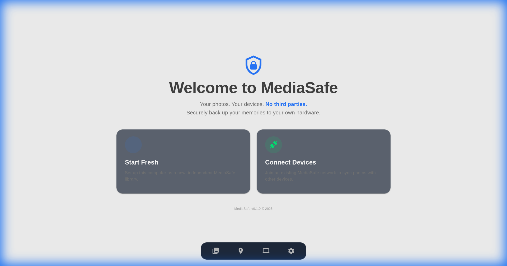

# Siegu 🛡️

[](LICENSE)
[](https://tauri.app/)
[](https://vuejs.org/)
[](https://www.rust-lang.org/)

**Siegu** (pronounced *see-goo*) is a privacy-first, local-only media management application. It's designed to organize, secure, and synchronize your photo and video library across your devices without ever touching the cloud.



## ✨ Key Features

### 🔒 Privacy-First AI
*   **Local Semantic Search**: Find photos by describing them (e.g., "sunset at the beach") using local **CLIP** models.
*   **Face Recognition**: Automatically detect and group faces using **UltraFace**, all processed offline on your hardware.
*   **Zero Cloud**: No telemetry, no tracking, and no external AI API calls. Your data stays yours.

### 🔄 Peer-to-Peer Synchronization
*   **Cloudless Sync**: Mirror your library between devices (Phone to PC, Laptop to Desktop) using encrypted **WebRTC** data channels.
*   **Mnemonic Discovery**: Connect devices securely using a simple 4-word mnemonic or QR code—no accounts required.
*   **Delta Transfers**: Only sync what's missing with intelligent manifest comparison.

### 📂 Smart Library Management
*   **Watched Folders**: Monitor specific directories (Pictures, Downloads, etc.) for real-time library updates.
*   **Optimized Storage**: Generates fast-loading thumbnails stored in a local SQLite database.
*   **Video Indexing**: Keyframe extraction and AI analysis make your video content as searchable as your photos.

## 🎨 Design Philosophy

Siegu follows a high-contrast, tactile design system:
*   **Minimalist Aesthetic**: Pure black interactive elements on a clean white/zinc background.
*   **Tactile Feedback**: Every interaction features smooth scaling and transitions for a premium feel.
*   **Consistency**: A unified "Button + Icon" language across the entire application.

## 🚀 Getting Started

### Prerequisites
*   **Node.js** (v18+)
*   **Rust** (Latest Stable)
*   **System Dependencies**: See [Tauri Prerequisites](https://tauri.app/v1/guides/getting-started/prerequisites)

### Installation
1.  **Clone & Enter**:
    ```bash
    git clone https://github.com/denzyldick/siegu.git
    cd siegu
    ```
2.  **Install**:
    ```bash
    npm install
    ```
3.  **Launch**:
    ```bash
    npm run tauri dev
    ```

## 🛠️ Tech Stack
*   **Frontend**: Vue 3, Vuetify 3, Vite
*   **Core**: Rust, Tauri v2
*   **Database**: SQLite (Rusqlite)
*   **AI Engine**: ONNX Runtime (ort)
*   **Networking**: WebRTC (webrtc-rs), WebSockets (tokio-tungstenite)

## 📜 License

Siegu is licensed under the **Functional Source License, Version 1.1 (FSL-1.1-Apache-2.0)**.

*   **Commercial Use**: Allowed for non-competing products.
*   **Competing Use**: Prohibited until the **Change Date**.
*   **Change Date**: **March 9, 2028** (at which point the license automatically becomes **Apache 2.0**).

See the [LICENSE](LICENSE) file for full details.

---
Built with ❤️ by [Denzyl Dick](https://github.com/denzyldick)
