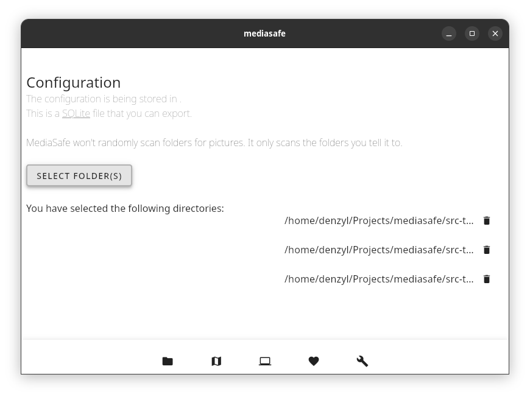

# MediaSafe

**MediaSafe** is a privacy-first, local-only media management application designed to organize and secure your photo library across your devices without relying on cloud services.



## Features

-   **🔒 Privacy First**: Your photos never leave your local network. MediaSafe runs entirely on your device.
-   **📁 Local Library Management**: Easily add and watch specific folders (e.g., Pictures, Downloads) effectively creating a centralized library.
-   **⚡ Background Scanning**: Automatically monitors your watched folders for new images and updates your library in real-time.
-   **🖼️ Smart Storage**: Generates and stores optimized Base64 thumbnails in a local SQLite database for fast loading and portability.
-   **❤️ Favorites**: Quickly mark your best shots as favorites for easy access.
-   **🖥️ Multi-Platform**: Built with [Tauri](https://tauri.app/) and [Vue.js](https://vuejs.org/), running smoothly on Linux, macOS, and Windows.

## Getting Started

### Prerequisites

-   [Node.js](https://nodejs.org/) (v16+)
-   [Rust](https://www.rust-lang.org/) (latest stable)
-   System dependencies for Tauri (see [Tauri Docs](https://tauri.app/v1/guides/getting-started/prerequisites))

### Installation

1.  Clone the repository:
    ```bash
    git clone https://github.com/denzyldick/mediasafe.git
    cd mediasafe
    ```

2.  Install dependencies:
    ```bash
    npm install
    ```

3.  Run the application in development mode:
    ```bash
    npm run tauri dev
    ```

## Usage

1.  **Add Folders**: Go to the **Settings** tab and click "Add Folder". Select a directory containing your photos.
2.  **View Photos**: Navigate to the **Home** tab to view your aggregated timeline of photos.
3.  **Manage**: Click on any photo to view it in full screen or mark it as a favorite.

## Technologies

-   **Frontend**: Vue 3, Vuetify
-   **Backend**: Rust, Tauri
-   **Database**: SQLite

## Privacy

MediaSafe is designed with privacy as its core principle. It does not track you, does not upload your data to any server, and works completely offline.
